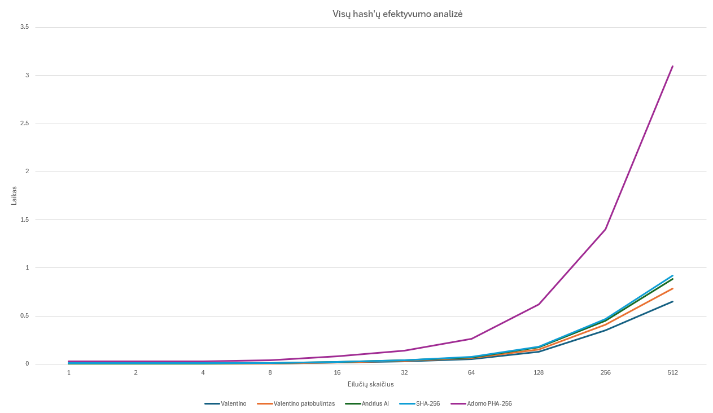

# Savo sugalvotas hash'as

Buvo atlikta pradinė versija v1.0 visiškai be DI įrankių, pasinaudojus jais padaryta maksimaliai patobulinta versija v2.0, išlaikant tą pačią unikalią idėją

---

## Idėja (sugalvota be DI)
Pagrindinę idėją galima aprašyti šitaip:  
1. Paimti 3-4 dideles konstantas, kurios padės išmaišime. Pačia pirmą priskiriame kaip seed'ą
2. Paimame iš vartotojo įvestį
3. Padalijame į byte'us
4. Persukame byte'us per k (k gauname per kintantį input'o ilgį ir konstantą ), k != 0
5. Gaminame hash'ą - paimame pradinį seed'ą, ir kiekvieną jo bit'ą lyginame su atitinkamu pramaišyto input'o bitu taikant XOR 
6. Gautą hash'ą d dar padauginame porą kartu iš konstantų ir perslenkam per kažkiek vienetų (pasirinkta 29, bet nebūtinai tiek)
7. Grąžiname 64bit hash'ą!

##  Pseudo-kodas
    function hash_own(input_string):
    SEED = constant_1
    bytes = EMPTY LIST

    for each character ch IN input_string:
        bytes.APPEND( ch_to_bits() )

    k = ( LENGTH(input_string) * constant_2 + Count_ones(bytes[0]) ) MOD LENGTH(bytes)
    IF k = 0 AND LENGTH(bytes) > 1:
        k = 1
    ROTATE_LEFT(bytes, k)

    hash = 64_bits(SEED)
    index = 0
    FOR each byte IN bytes:
        FOR bit FROM 0 TO 7:
            position = bit_index MOD 64
            hash[pos] = hash[pos] XOR byte[b]
            bit_index = bit_index + 1

    h = h * constant_3
    h = h XOR (h shift >> 29)
    h = h * constant_4

    return h
    

## Idėja (hashui su DI)

1. Paimti 4 dideles konstantas (IV – inicializacijos vektorius), kurios tampa pradiniu būsenos masyvu.
2. Įvestį iš vartotojo paversti į baitus.
3. Atlikti padding (pridėti 0x80 baitą ir užpildyti iki artimiausio bloko, gale įdėti įvesties ilgį), kad blokai būtų vienodo dydžio.
4. Įvestį padalinti į 64 baitų blokus. Kiekvieną bloką paversti į 64-bit žodžius.
5. Būseną (state) atnaujinti panaudojant XOR tarp pradinės būsenos ir žodžių.
6. Kiekvieną bloką apdoroti permute funkcija: rotacijos, XOR’ai ir daugybos su didelėmis konstantomis, kad visi bitai kuo labiau susimaišytų.
7. Užbaigti su finalizacija, dar kartą pakaitalioti būseną XOR ir permute funkcijomis, kad net trumpi/panašūs įėjimai duotų visiškai skirtingą rezultatą.
8. Grąžinti keturis 64-bit sveikus skaičius kaip vieną 256-bit maišą (atvaizduojamą kaip 64 simbolių šešioliktainį stringą).

##  AI Versijos Pseudo-kodas
function custom_hash256(input_string):
    
    # --- Constants / IVs ---
    IV0 = 0x0123456789ABCDEF
    IV1 = 0xFEDCBA9876543210
    IV2 = 0xF0E1D2C3B4A59687
    IV3 = 0x89ABCDEF01234567
    state = [IV0, IV1, IV2, IV3]

    # --- Helper functions ---
    function rotl64(x, r):
        return (x << r) | (x >> (64 - r))

    function fmix64(k):
        k ^= k >> 33
        k *= 0xff51afd7ed558ccdl
        k ^= k >> 33
        k *= 0xc4ceb9fe1a85ec53
        k ^= k >> 33
        return k

    function permute(state, block_words):
        # simple 4-word mixing inspired by your C++ code
        for i = 0 to 3:
            state[i] = state[i] ^ block_words[i]
        
        a, b, c, d = state[0], state[1], state[2], state[3]

        # apply rotations, XORs, additions
        a ^= b >> 1;  b ^= c >> 3;  c ^= d >> 5;  d ^= a >> 7
        a += d; b += a; c += b; d += c

        # final fmix
        state[0] = fmix64(a ^ (b + c + d))
        state[1] = fmix64(b ^ (a + c + d))
        state[2] = fmix64(c ^ (a + b + d))
        state[3] = fmix64(d ^ (a + b + c))

        return state

    # --- Padding ---
    msg = to_bytes(input_string)
    msg = msg || 0x80   # append 0x80
    while (len(msg) + 16) % 64 != 0:
        msg = msg || 0x00
    msg = msg || encode_128bit_length(len(input_string))

    # --- Process blocks ---
    for each 64-byte block B in msg:
        words = split B into 4 × 64-bit integers
        state = permute(state, words)

    # --- Finalization ---
    zero_block = [0, 0, 0, 0]
    for i = 0 to 3:
        state[i] = state[i] XOR (0x0123456789ABCDEF XOR state[(i+1) mod 4])
    state = permute(state, zero_block)
    state = permute(state, zero_block)

    # --- Output ---
    return hex(state[0]) || hex(state[1]) || hex(state[2]) || hex(state[3])

# Eksperimentinis tyrimas: nuosavas hash'as (be patobulinimo)
Buvo atlikti eskperimentiniai tyrimai pagal duotus reikalavimus. 

## 1. Hash funkcijos savybės

| Savybė                     | Rezultatas (Taip/Ne) |
|-----------------------------|-------------|
| Išvedimo dydis fiksuotas    | Taip / Ne   |
| Deterministiškumas          | Taip / Ne   |

---

## 2. Efektyvumas (konstitucija.txt)

**Valentino hash'as**
| Eilučių skaičius | Vidutinis laikas (ms) |
|------------------|------------------------|
| 1                |  0.0037             |
| 2                | 0.0031                |
| 4                | 0.0041        |
| 8                | 0.0062    |
| 16               | 0.0152    |
| 32               | 0.0264    |
| 64               | 0.0503    |
| 128              | 0.1280    |
| 256              | 0.3506 |
| 512              | 0.6501  |

**Valentino patobulintas hash'as**
| Eilučių skaičius | Vidutinis laikas (ms) |
|------------------|------------------------|
| 1                | 0.0011             |
| 2                | 0.0009                |
| 4                | 0.0010        |
| 8                | 0.0015    |
| 16               | 0.0032    |
| 32               | 0.0057    |
| 64               | 0.0110    |
| 128              | 0.0263    |
| 256              | 0.0577 |
| 512              | 0.1347  |

**Andriaus su AI darytas hash'as**
| Eilučių skaičius | Vidutinis laikas (ms) |
|------------------|------------------------|
| 1                | 0.0016            |
| 2                | 0.0034                |
| 4                | 0.0021       |
| 8                | 0.0021    |
| 16               | 0.0034    |
| 32               | 0.0073    |
| 64               | 0.0102    |
| 128              | 0.0211    |
| 256              | 0.0448 |
| 512              | 0.1022  |

**SHA256 hash'as**
| Eilučių skaičius | Vidutinis laikas (ms) |
|------------------|------------------------|
| 1                | 0.0067            |
| 2                | 0.0038                |
| 4                | 0.0033       |
| 8                | 0.0027    |
| 16               | 0.0029    |
| 32               | 0.0035    |
| 64               | 0.0047    |
| 128              | 0.0077    |
| 256              | 0.0147 |
| 512              | 0.0314  |

**Adomo naudotas PHA256 hash'as (kitos grupės palyginimui)**
| Eilučių skaičius | Vidutinis laikas (ms) |
|------------------|------------------------|
| 1                | 0.0134            |
| 2                | 0.0153                |
| 4                | 0.0182       |
| 8                | 0.0276    |
| 16               | 0.0546    |
| 32               | 0.0946    |
| 64               | 0.1880    |
| 128              | 0.4373    |
| 256              | 0.9302 |
| 512              | 	2.1761  |

### Grafikas

---

## 3. Kolizijų paieška

Sugeneruota po **100 000 atsitiktinių string porų**, skirtingo ilgio (10, 100, 500, 1000 simbolių).  
Patikrinta, kiek jų hash’ai sutapo.

**PASTABA:** Visos lentelės gaunasi vienodos, nes nepavyko rasti kolizijų nė vienoje Hash funkcijoje!

### Nuosavo / Nuosavo patobulinto / AI / SHA256 / Adomo individalaus Hash'u kolizijų paieška
| String ilgis | Kolizijų skaičius | Kolizijų dažnumas (proc) |
|--------------|-------------------|--------------------------|
| 10           | 0               |  0 %                       |
| 100          | 0               |  0 %                       |
| 500          | 0               |  0 %                       |
| 1000         | 0               |  0 %                       | 

---

## 4. Lavinos efektas

Sugeneruota **100 000 porų**, kurios skiriasi tik vienu simboliu, 64 bitų ilgio.
Skirtumai matuoti **bitų** ir **hex** lygmeniu.

### Bitų lygmuo

| Hash'as                  | Min skirtumas (%) | Max skirtumas (%) | Vidutinis (%) |
|---------------------------|-----------------|-----------------|---------------|
| Custom                    | 119             | 217             | 33.01         |
| Valentino                 | 9               | 65              | 30.26         |
| Valentino patobulintas    | 139             | 256             | 38.88         |
| MD5                       | 52              | 125             | 33.01         |
| SHA-1                     | 61              | 142             | 33.01         |
| SHA-256                   | 116             | 215             | 33.01         |
| Adomo PHA256              | 36              | 63              | 49.82            |

### Hex lygmuo

| Hash'as                  | Min skirtumas (%) | Max skirtumas (%) | Vidutinis (%) |
|---------------------------|-----------------|-----------------|---------------|
| Custom                    | 49              | 64              | 93.74         |
| Valentino                 | 5               | 16              | 85.75         |
| Valentino patobulintas    | 48              | 64              | 93.73         |
| MD5                       | 22              | 32              | 93.74         |
| SHA-1                     | 28              | 40              | 93.75         |
| SHA-256                   | 51              | 64              | 93.76         |
| Adomo PHA256              | 75              | 100              | 93.50            |

## 5. Negrįžtamumo demonstracija

Metodas: parodyti, kad hash'as turi kiekvieną savybę, kad funkcija atitiktų puzzle friendliness, negrįžtamumo reikalavimus (Deterministiškumas, lavinos efektas, t.t.)
Pademonstruota, kad neįmanoma atkurti pradinio input vien iš hash’o visuose variantuose.

 Funkcija              | Deterministiškumas | "Hiding" | Lavinos efektas| Negrįžtamumas |
|-----------------------|---------------|--------------------------|---------------------------|--------------|
| Valentino             | Taip          | Taip                     | Taip                      | Taip         |
| Valentino patobulintas| Taip          | Taip                     | Taip                      | Taip         |
| Andriaus AI           | Taip          | Taip                     | Taip                      | Taip         |
| SHA-1                 | Taip          | Taip                     | Taip                      | Taip         |
| SHA-256               | Taip          | Taip                     | Taip                      | Taip         |

---

## 6. Palyginimas: Valentino v1.0 (originalas) vs Valentino v2.0 (patobulinta su DI)

Trumpas santraukinis palyginimas pagrindinėms savybėms ir eksperimentiniams rezultatams.

| Savybė             | Valentino v1.0 (original)                 | Valentino v2.0 (patobulinta)                    | Komentaras / reikšmė |
|------------------------------|-------------------------------------------|--------------------------------------------------|----------------------|
| Išvesties dydis              | 64 bitai                                  | 256 bitų                                         | v2 turi žymiai didesnį output — saugesnis prieš brute-force. |
| Deterministiškumas          | Taip                                      | Taip                                             | Abi versijos deterministinės. |
| Vidutinis laikas per visus testus [ms]      | **0.1238 ms**     | **0.0243 ms**             | v2 ≈ **80 %** greitesnė pagal pateiktus vidurkius (mažesnis vid. laikas). |
| Efektyvumo skalavimas       | Laikas auga greitai su didesniu įvedimu   | Laikas auga lėčiau            | Matosi iš eilučių skaičiaus lentelių (v2 stabiliau mažesnis). |
| Kolizijų paieška     | 0 / 100000 (visiems ilgiams)             | 0 / 100000 (visiems ilgiams)                    | Nėra aptiktų kolizijų abiem. |
| Lavinos efektas (bitų vid)  | ~30.26 %                                  | ~38.88 %                                        | v2 rodo geresnį bitų difuzijos vidurkį, taigi, geresnis lavinos efektas. |
| Lavinos efektas (hex vid)   | ~85.75 %                                  | ~93.73 %                                        | v2 stipresnis ir hex-lygyje (daugiau skirtingų heks-baitų). |
| Negrįžtamumas | Taip           | Taip        | v2 yra praktiškai sunkiau „invertuoti“ dėl 256 bitų output. |

---

## 7. Išvados

***Valentino hash'as***

**Stiprybės**:

- Paprastas ir lengvas – lengvai įgyvendinamas ir labai greitai veikia, nes naudoja tik baitų rotacijas ir XOR.
- Seed priklausomybė, dėl kurios pradinė konstanta ir rotacijos užtikrina šiokį tokį unikalumą.

**Trūkumai**:

- Silpnas lavinos efektas – testuose gauta tik apie ~30% bitų pokyčių (vietoj kitų 33%), todėl įvesties pakeitimai nevisiškai pasklinda.
- Mažas išvesties dydis – 64 bitų hash'as yra mažas ir lengvai pažeidžiamas brute-force atakų.

***Andriaus hash'as***

**Stiprybės**:
                     
- Stiprūs avalanche-effect rezultatai - beveik SHA lygio.
- Didelis output dydis - 256 bitai, sunku brute-forcinti.
- Rotacijų ir daugybos naudojimas – keli konstantų, rotacijų ir fmix64 veiksmų sluoksniai pagerina difuziją.

**Trūkumai**:
  
- Lėtesnis nei mažesni hash'ai
- Sudėtingesnė realizacija – reikia paddingo, kelių būsenos dalių ir permutacijų, todėl implementacija sudėtingesnė nei paprastų hash’ų.
